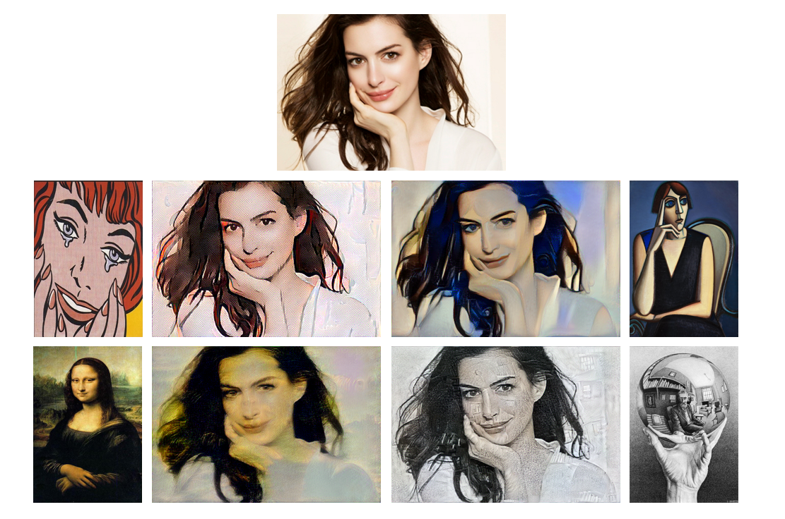

# Neural Style Transfer

[Neural style transfer] is an algorithm that combines the content of one image with the style of another image using CNN. Given a content image and a style image, the goal is to generate a target image that minimizes the content difference with the content image and the style difference with the style image. 

<p align="center"></p>


#### Content loss

To minimize the content difference, we forward propagate the content image and the target image to pretrained [VGGNet](https://arxiv.org/abs/1409.1556) respectively, and extract feature maps from multiple convolutional layers. Then, the target image is updated to minimize the [mean-squared error](https://github.com/yunjey/pytorch-tutorial/blob/master/tutorials/03-advanced/neural_style_transfer/main.py#L92-L93) between the feature maps of the content image and its feature maps. 

#### Style loss

As in computing the content loss, we forward propagate the style image and the target image to the VGGNet and extract convolutional feature maps. To generate a texture that matches the style of the style image, we update the target image by minimizing the mean-squared error between the Gram matrix of the style image and the Gram matrix of the target image (feature correlation minimization). See [here](https://github.com/yunjey/pytorch-tutorial/blob/master/tutorials/03-advanced/neural_style_transfer/main.py#L95-L105) for how to compute the style loss.


<br>

## Usage 

```bash
$ pip install -r requirements.txt
$ python main.py --content='png/content.png' --style='png/style.png'
```

<br>

## Results
The following is the result of applying variaous styles of artwork to Anne Hathaway's photograph.


